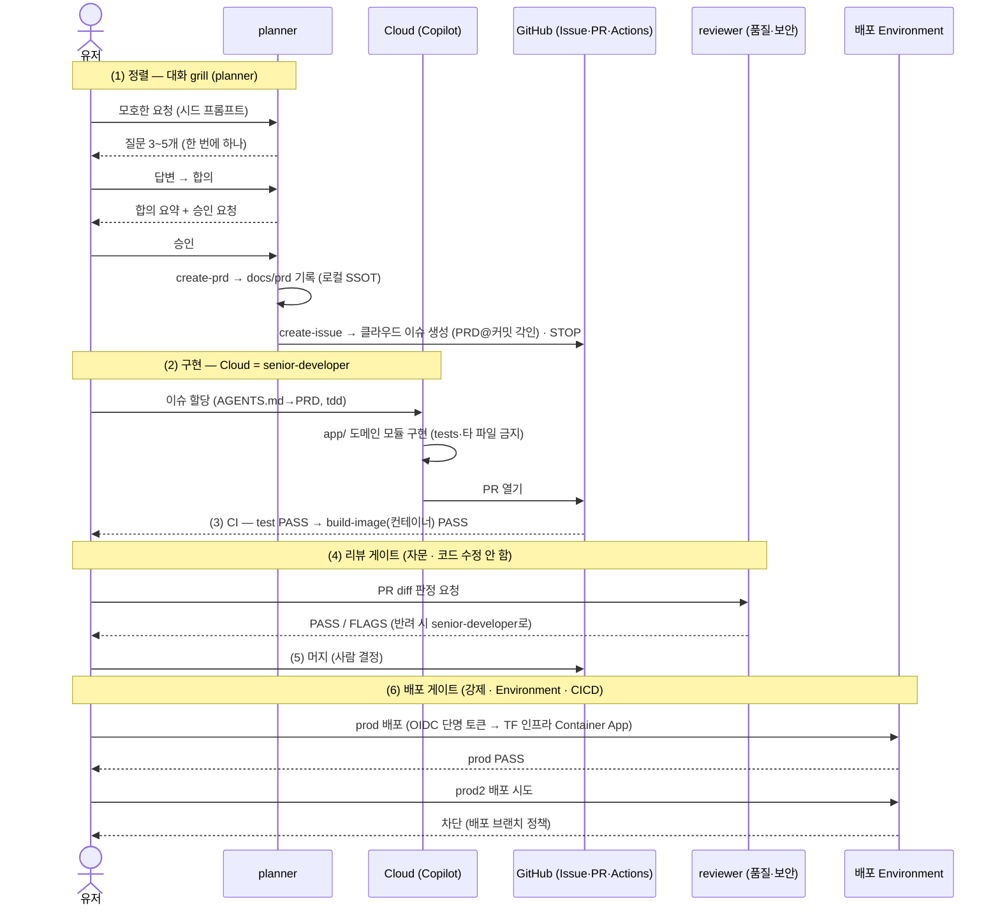

# ECG Inference Service — Cloud + CICD 통제면 일주 데모

GHCP App 한 화면에서 **요구사항 합의 → 이슈 → Cloud 구현 → PR → CI(test → 컨테이너 빌드) →
리뷰 게이트 → 머지 → CICD 배포(TF 인프라 · 사람 승인 게이트)**까지 한 바퀴 도는 데모.
세션 논지(**편의=통제**)를 끝까지 보여준다.

## 전체 흐름

<!-- 긴 설명은 아래 다이어그램 코드 상단의 %% 주석에 넣었다(렌더에는 안 보임 — 시퀀스는 짧게 유지). -->



## 현재 구조
- 시드는 **동작하는 서비스 스켈레톤**이다: `GET /healthz`만 있고 `test`(healthz 스모크) ✅ → `build-image` ✅.
- 도메인 요구는 시드에 **없다.** 오늘 그 요구를 **GitHub Space**에서 grill로 정렬해 PRD로 만들고, 그 PRD를 계약으로 `app/`에 구현한다(`create-prd` → `create-issue` → Cloud `tdd` red→green).
- 기능이 green이 되면 컨테이너 이미지가 빌드된다. 참조 구현은 폴백 브랜치로 준비한다.

## 파이프라인 (참가자 CI · 클러스터·자격증명 미사용)
`test → build-image` 2단계. 테스트가 초록이어야 `docker build`가 돌아 이미지가 아티팩트로 남는다.
- 배포는 **별도 워크플로**(`deploy-azure.yml`, 진행자 전용): `prod` 브랜치 push → OIDC 단명 토큰으로
  Azure 로그인 → **TF 프로비저닝 Container App**(`harness-rg`/`harness-container-app`)에 ACR 빌드 이미지를 배포.
- 배포 거버넌스: `environment: production`의 **배포 브랜치 정책**이 `prod`만 허용 →
  `prod2`에서 트리거해도 배포 게이트에서 막힌다(대조 시연). ruleset이 `prod` 브랜치 자체를 보호한다.
- 배포는 CICD가 수행한다 — 전용 배포 에이전트는 없다(관심사 분리는 워크플로 + Environment 게이트로).

## 데모 단계 ↔ GHCP App 동작

### ① Grill → 이슈  (App 채팅)
- 유저가 시드 프롬프트(모호한 한 줄)를 던진다.
- **`planner` 에이전트**가 `grill`로 되물어 정렬한다(대화). 도메인 맥락은 **GitHub Space**를 근거로 삼고, 합의된 규칙은 `create-prd`가 `docs/prd/`에 **새로 기록**한다(시드엔 PRD가 없다 — 랩에서 태어난다).
- 내용이 충분하면 **사용자 승인** 후 `create-prd`(로컬 `docs/prd/` 기록) → `create-issue`로 **GitHub 이슈(클라우드)**를 만든다 — 본문에 `PRD 기준: docs/prd/… @ <커밋해시>` 각인. 로컬 이슈 파일은 두지 않는다(클라우드가 이슈 SSOT).
- 포인트: "매번 프롬프트로 부탁하던 합의를, 레포에 PRD로 한 번 적어 반복 가능하게."

### ② Cloud 구현  (이슈 → Cloud agent)
- 이슈를 Cloud(Copilot coding agent)에 할당. Cloud가 AGENTS.md→PRD를 읽고 `tdd`로 PRD 계약을 `app/`에 구현한다(senior-developer 역할).
- 비동기: 던져두고 다른 설명을 하다가 알림으로 결과를 받는다 — 이 "비동기 편의"가 같은 화면에서 관찰된다.

### ③ PR + CI  (Cloud → PR)
- Cloud가 PR을 연다. PR의 Checks 탭에서 CI가 자동으로 돈다: `test`(pytest) → `build-image`(docker build).
- `tdd`가 테스트를 먼저 red로 쓰면 `test` ❌ → 구현으로 `test` ✅ → `build-image` ✅(컨테이너 이미지 아티팩트). (healthz 스모크는 시드부터 초록이다.)
- 거버넌스 관찰: Copilot이 연 PR의 워크플로는 GitHub이 `action_required`로 **보류**한다. 사람이 "Approve and run"을 눌러야 CI가 돈다 — 봇 주도 변경에도 사람 게이트가 한 겹 더.

### ④ 리뷰 게이트  (reviewer)
- **`reviewer` 에이전트**가 diff를 심사한다: `review-integrity`(정렬·범위·정확성·테스트·회귀·가독성·관찰성·상태정직성) + `review-security`(PHI·시크릿·OWASP). **판정만** 하고 고치지 않는다 — 문제가 있으면 senior-developer로 반려한다.
- 이 레포(private/free)엔 branch protection이 없어 이 게이트는 **자문(advisory)** — 사람이 지키는 규율.

### ⑤ 머지  (사람 결정)
- 두 CI 체크가 초록이고 리뷰가 통과하면 사람이 머지한다. main이 깨끗해진다.

### ⑥ 배포 거버넌스  (CICD → TF 인프라 · 진행자 전용)
- `main` → **PR to prod** → 머지가 완료되면 `deploy-azure.yml`이 **OIDC 단명 토큰**(장수 시크릿 없음)으로 Azure에 로그인해 TF 프로비저닝 Container App(`harness-rg`/`harness-container-app`)에 이미지를 배포한다.
- `production` Environment가 **강제 게이트**다: 배포 브랜치 정책이 `prod`만 허용 → `prod2`는 여기서 차단(대조 시연). 배포는 에이전트가 아니라 CICD가 한다.
- 포인트: "봇이 코드를 빨리 내도, 민감 배포는 사람이 정한 브랜치·환경 게이트 뒤에서만 나간다."

## 시작 프롬트 — 유저가 던지는 요구 (대본 없음)

하네스(AGENTS.md·에이전트·스킬)가 절차를 들고 있으므로, 유저는 매끄러운 대본이 아니라 **자연스러운 요구** 한 줄만 던진다. 도메인 규칙은 코드가 아니라 **Copilot Space**에 있고, 그 요구가 Space를 근거로 정렬·구현된다.

```text
내 Copilot Space 'Medical AI Demo Space'의 도메인 문서를 근거로,
ECG 추론을 모델에 태우기 전에 요청을 검증하는 엔드포인트를 만들어줘 —
필드·허용값·판정 규칙은 그 문서에 있어.
```

- ① 정렬: 모호해도 좋다 — 이 한 줄을 던지면 `planner`가 Space를 근거로 `grill`로 되묻는다.
- ② 구현: 합의로 만들어진 이슈를 **Cloud에 할당**하면 끝. Cloud가 `AGENTS.md`→PRD→`tdd`를 스스로 따른다 — 별도 지시가 필요 없다(원하면 "이 이슈 구현해줘" 한 줄로 충분).

## 로컬에서 미리 돌려보기 (리허설/폴백 준비)
```bash
python3 -m venv .venv && . .venv/bin/activate && pip install -r requirements.txt
python -m pytest -q                                   # 시드: 1 passed(healthz) — 기능 구현 후 증가
docker build -t ecg-service:local .                   # 구현 후 초록이면 이미지가 빌드된다(선택)
```

## 라이브 폴백 (Cloud 지연/네트워크 대비)
- 미리 만들어 둔 브랜치/PR을 준비해두고, Cloud 런이 늦으면 "여기 미리 돌려둔 결과"로 전환.
- ②의 결과 커밋을 사전 브랜치로 보관(예: `prebaked/feature`).

---

## 두 갈래 — 통합(main) / 릴리스(prod)

이 레포는 **2브랜치 승격 모델**을 쓴다. `main`은 기능 통합 게이트(ci), `prod`는 릴리스/배포 게이트(cd).

| 단계 | 워크플로 | 트리거 | 무엇 | 누가 | Azure |
|------|----------|--------|------|------|-------|
| **통합(ci)** | `.github/workflows/ci.yml` | `main`으로의 PR·머지, `prod`로의 PR | `test`(pytest) → `build-image`(docker build → **이미지 아티팩트** 업로드). prod PR엔 `guard-prod-source`로 소스=main 검증 | 모든 참석자 | 불필요 |
| **릴리스(cd)** | `.github/workflows/deploy-azure.yml` | `prod` 머지(push) | OIDC로 Azure 로그인 → `harness-rg`의 Container App(`harness-container-app`)에 이미지 **실배포**(ACR 빌드) | 진행자(1인) | 필요(OIDC) |

- **통합(ci)**는 클라우드 자격증명·레지스트리가 필요 없다. 시드 `main`은 healthz만 있어 `test`가 초록이고,
  랩에서 기능을 `tdd`로 만들면 테스트가 red→green으로 움직이며, 초록이 되면 이미지가 빌드되어 아티팩트로 남는다.
  기능 브랜치 → **PR to main** → 머지 시 ci만 돈다(배포 없음).
- **릴리스(cd)**는 `main` → **PR to prod** → 머지가 완료되면 `deploy-azure.yml`이 실배포한다.
  `production` 환경의 **배포 브랜치 정책**을 `prod`로 제한해 `prod2` 등 다른 브랜치에서 트리거해도 배포 게이트에서
  막힌다(대조 시연). 세션 후 `infra/scripts/teardown-azure.sh`로 리소스를 삭제한다.
- **"main만 prod로 머지" 강제:** GitHub 룰셋엔 PR 소스 브랜치 제한이 없어, `ci.yml`의 `guard-prod-source` 잡이
  prod로 향하는 PR의 head가 `main`인지 검사해 아니면 실패한다. 이 잡을 `prod` 룰셋의 **required status check**로
  걸면 feat→prod 직행 PR은 머지가 잠긴다(§D).

> OIDC 자격증명(`AZURE_CLIENT_ID`/`AZURE_TENANT_ID`/`AZURE_SUBSCRIPTION_ID`)은 `production` 환경 시크릿으로 등록하며,
> 장수 시크릿을 저장하지 않는다(federated credential = `repo:…:environment:production`).

---

## 새 레포로 셋업하기 (템플릿 → 데모 레포)

템플릿에서 만든 새 레포는 **git 내용만** 복사된다 — Environment·secrets·ruleset·OIDC federated
credential은 **서버측 설정이라 따라오지 않는다.** 통합 트랙(`ci.yml`)은 자격증명이 필요 없어
**레포가 public이면 바로 GHCP App에서 프롬프트를 던져도 된다.** 아래 A~E는 **릴리스 배포 트랙**
(`deploy-azure.yml`)의 거버넌스를 시연하기 위한 1회 세팅이다.

### A. Azure OIDC 자격증명 + 환경 시크릿
1. 새 레포 subject로 federated credential 추가(멱등):
   ```bash
   REPOS="hy2219/<새레포>" ./infra/scripts/bootstrap-identity.sh
   # → subject: repo:hy2219/<새레포>:environment:production
   ```
2. 3개 식별자를 **`production` 환경 시크릿**으로 등록한다(먼저 §C로 `production` 환경을 만든 뒤).
   OIDC엔 client secret이 없어 이 3개는 사실 시크릿이 아니라 식별자지만, `environment: production`
   잡에서만 읽히도록 **환경 스코프**에 두는 게 배포 게이트와 맞다(repo 스코프도 동작):
   ```bash
   gh secret set AZURE_CLIENT_ID       --env production -R hy2219/<새레포> -b <client-id>
   gh secret set AZURE_TENANT_ID       --env production -R hy2219/<새레포> -b <tenant-id>
   gh secret set AZURE_SUBSCRIPTION_ID --env production -R hy2219/<새레포> -b <subscription-id>
   ```
   확인: Settings → Environments → production → Environment secrets. 값·근거는 `infra/README.md`.

### B. Terraform 인프라 (최초 1회)
```bash
cd infra
cp terraform.tfvars.example terraform.tfvars   # 필요시 값 조정
terraform init && terraform apply              # harness-rg: ACR/Log Analytics/ACA env/Container App
```
아이덴티티(az 부트스트랩)와 인프라(TF)를 나눈 이유는 `infra/README.md`.

### C. production Environment + 배포 브랜치 정책 (강제 게이트)
Settings → Environments → **New environment: `production`**
- **Deployment branches and tags**: *Selected branches* → `prod`만 추가 (← prod2 차단 대조의 핵심)
- (선택) **Required reviewers**: 본인 → 배포 전 사람 승인 게이트
- **§A의 AZURE_* 3개를 이 환경의 시크릿으로 둔다** — `environment: production` 잡에서만 읽히고 repo 스코프보다 우선(가장 구체적인 스코프가 이김).

CLI 예시:
```bash
gh api -X PUT repos/hy2219/<새레포>/environments/production \
  -F 'deployment_branch_policy[protected_branches]=false' \
  -F 'deployment_branch_policy[custom_branch_policies]=true'
gh api -X POST repos/hy2219/<새레포>/environments/production/deployment-branch-policies -f name=prod
```

### D. branch ruleset (prod 브랜치 보호)
Settings → Rules → **Rulesets → New branch ruleset**
- **Target branches**: ref name pattern `prod`
- **Rules**: *Require a pull request before merging*(승인 1 + 최근 푸시 승인) → "머지로만 배포"
  - **Require status checks to pass** → `guard-prod-source` 추가 (← **"main만 prod로 머지" 강제**: prod로 향하는 PR의 head가 main이 아니면 이 체크가 red → 머지 잠김)
- **Enforcement status: Active**

> PR 필수 규칙이 직접 push·force push를 이미 차단하므로 *Block force pushes*는 중복이라 생략한다.
> GitHub 룰셋은 PR **소스 브랜치**를 네이티브로 제한하지 못한다 — 그래서 `ci.yml`의 `guard-prod-source`
> 필수 체크로 "main → prod"만 통과시킨다.

### E. prod/prod2 브랜치 + 프롬프트
```bash
git switch -c prod  main && git push -u origin prod
git switch -c prod2 main && git push -u origin prod2   # 대조용(게이트에서 차단됨)
```
A~D가 서면 GHCP App에서 위 "시작 프롬트"로 통합 트랙(main)을 시작하고, 릴리스 세그먼트에서
`main` → PR to `prod` 머지 → 배포 성공 / `prod2` 직접 push → 게이트 차단을 대조 시연한다.
